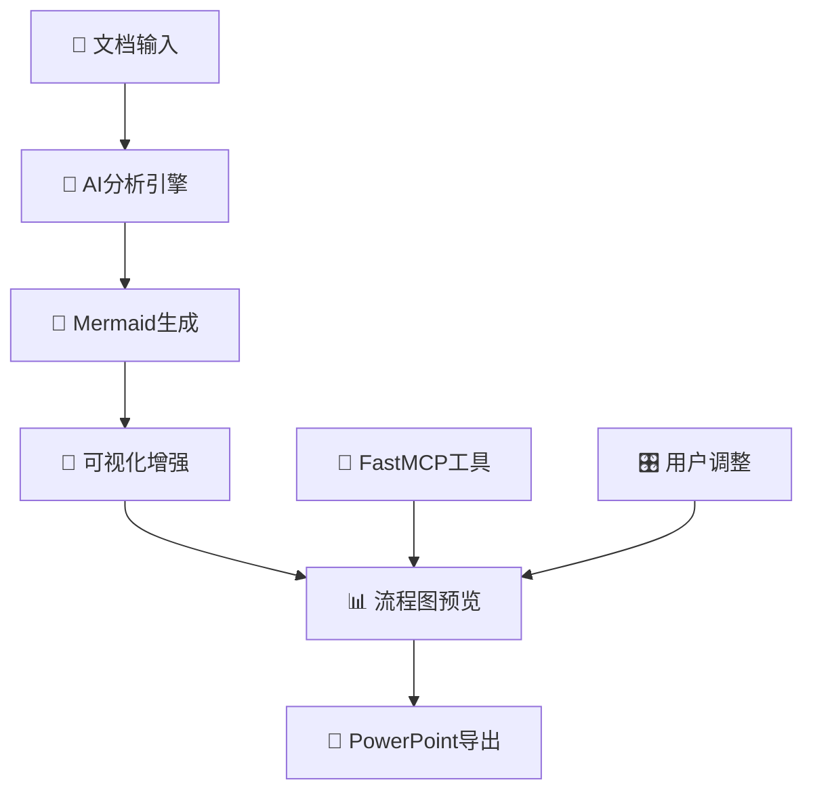

# FlowMind AI - 智能论文流程图生成器

<div align="center">


**🚀 AI驱动的学术论文到PowerPoint流程图自动生成系统**

[](https://github.com/giao-123-sun/dofanxin)
[](LICENSE)
[](https://www.westlake.edu.cn/)

[🌐 在线体验](https://flowmind-ai.vercel.app) | [📖 文档](docs/) | [🎯 演示视频](demo/) | [💬 联系我们](mailto:giao_giao@hotmail.com)

</div>

## 🌟 产品简介

FlowMind AI 是一款革命性的AI驱动工具，专为学术研究者和专业人士设计。它能够智能分析学术论文或文本内容，自动生成专业的PowerPoint流程图，大幅提升研究展示效率。

### 🎯 核心特性

- **🤖 AI智能分析**: 基于Google Gemini 2.5 Flash Lite的先进语言模型
- **📄 多格式支持**: 支持PDF文档和纯文本输入
- **🎨 可视化增强**: 自动添加表情符号，提升图表可读性
- **💼 专业输出**: 生成高质量PowerPoint演示文稿
- **🔧 实时调整**: 支持流程图的实时预览和调整
- **🌍 国际化**: 支持中英文双语界面

## 🏗️ 技术架构



### 技术栈

- **前端**: Astro + React + TypeScript
- **AI引擎**: OpenRouter API + Google Gemini
- **图表生成**: Mermaid.js
- **文档处理**: PDF-Parse
- **PPT生成**: PptxGenJS
- **可视化工具**: FastMCP

## 🚀 快速开始

### 环境要求

- Node.js 18+
- npm 或 yarn
- OpenRouter API Key

### 安装步骤

```bash
# 克隆仓库
git clone https://github.com/giao-123-sun/dofanxin.git
cd dofanxin

# 安装依赖
npm install

# 配置环境变量
cp .env.example .env.local
# 编辑 .env.local 添加你的 API Key

# 启动开发服务器
npm run dev
```

### 环境变量配置

```env
# OpenRouter API 配置
OPENROUTER_API_KEY=your_api_key_here
OPENROUTER_API_URL=https://openrouter.ai/api/v1/
OPENROUTER_MODEL=google/gemini-2.5-flash-lite-preview-06-17
```

## 📱 使用指南

### 1. 输入文档
- 上传PDF学术论文
- 或直接粘贴文本内容

### 2. AI分析
- 系统自动分析文档结构
- 提取关键流程和逻辑关系

### 3. 流程图生成
- 生成Mermaid格式流程图
- 自动添加相关表情符号

### 4. 可视化预览
- 实时预览生成的流程图
- 支持交互式调整

### 5. 导出PowerPoint
- 一键生成专业PPT文件
- 支持自定义样式和布局

## 🧪 测试验证

```bash
# 运行FastMCP测试
node test-fastmcp.js

# 运行API集成测试
node test-api.js

# 启动演示页面
open demo.html
```

## 💰 定价方案

### 🎁 免费体验
- **首次使用免费**
- 包含完整功能体验
- 生成1个流程图

### 💎 按次付费
- **¥29/次** - 标准版
- **¥49/次** - 专业版（包含高级定制）
- **¥99/次** - 企业版（批量处理）

### 📞 预约使用
想要使用FlowMind AI？请通过以下方式预约：
- 📧 邮箱: [giao_giao@hotmail.com](mailto:giao_giao@hotmail.com)
- 🌐 官网: [flowmind-ai.vercel.app](https://flowmind-ai.vercel.app)

## 👨‍💻 作者信息

**Joey Sun**
- 🏫 西湖大学 (Westlake University)
- 📧 联系邮箱: [giao_giao@hotmail.com](mailto:giao_giao@hotmail.com)
- 🐙 GitHub: [@giao-123-sun](https://github.com/giao-123-sun)

## 🤝 贡献指南

我们欢迎社区贡献！请查看 [CONTRIBUTING.md](CONTRIBUTING.md) 了解详细信息。

### 开发流程
1. Fork 本仓库
2. 创建特性分支 (`git checkout -b feature/AmazingFeature`)
3. 提交更改 (`git commit -m 'Add some AmazingFeature'`)
4. 推送到分支 (`git push origin feature/AmazingFeature`)
5. 开启 Pull Request

## 📄 许可证

本项目采用 MIT 许可证 - 查看 [LICENSE](LICENSE) 文件了解详情。

## 🙏 致谢

- 感谢 [OpenRouter](https://openrouter.ai/) 提供AI API服务
- 感谢 [Mermaid](https://mermaid-js.github.io/) 提供图表生成支持
- 感谢西湖大学提供研究支持

## 📊 项目统计


---

<div align="center">

**🌟 如果这个项目对你有帮助，请给我们一个星标！**

Made with ❤️ by [Joey Sun](https://github.com/giao-123-sun) at Westlake University

</div>